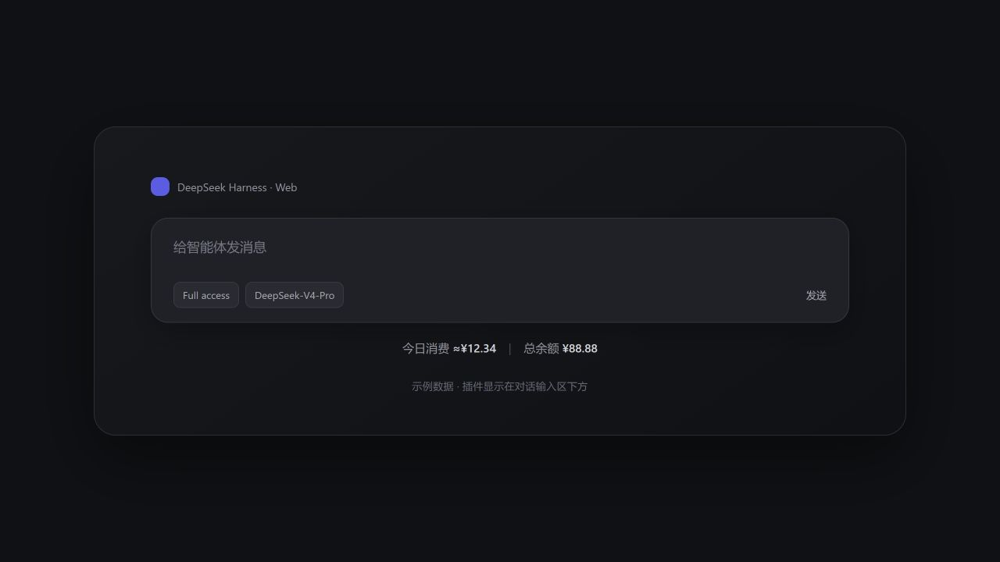
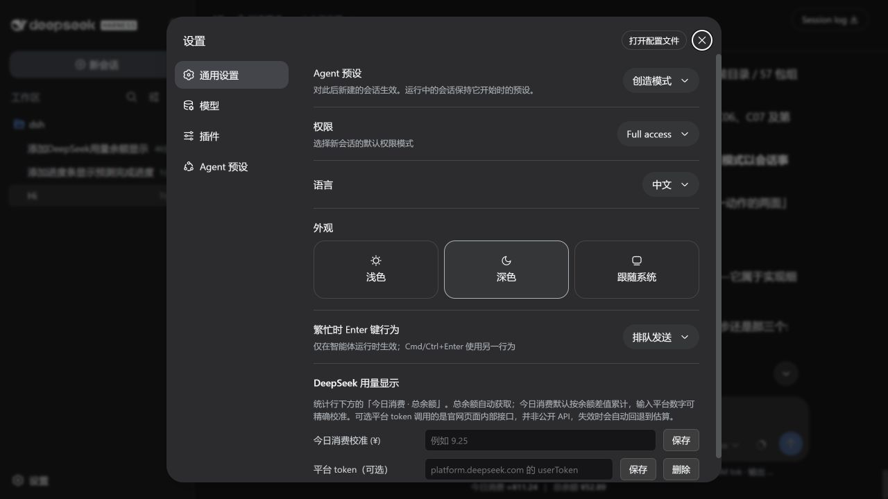

# DeepSeek Harness Usage

[](https://github.com/Arslan-jh/deepseek-harness-usage/actions/workflows/ci.yml)
[](https://github.com/topics/dsh-plugin)
[](LICENSE)

在 DeepSeek Harness 对话框下方，直接显示：**今天大约花了多少钱，以及账户还剩多少钱。**

不需要打开控制台，也不需要手工记余额。插件每 3 分钟自动更新。



> 图中是示例数据。`≈` 表示今日消费是估算值；总余额来自 DeepSeek 官方余额接口。

## 它能做什么

| 显示项 | 含义 |
| --- | --- |
| 今日消费 | 从当天账户余额变化估算出的人民币消费额 |
| 总余额 | DeepSeek 账户当前可用余额 |
| 充值识别 | 充值或赠送额度增加时，不会把当天消费错误清零 |
| 自动刷新 | DSH 宿主和浏览器每 3 分钟更新一次 |

这个插件适合回答一个很直接的问题：**我今天用了多少 DeepSeek 额度？**

它不是 Token 分析仪表盘，也不展示每个会话、模型或工具的详细消耗。

## 安装

```sh
dsh plugin --profile web add github:Arslan-jh/deepseek-harness-usage
dsh --profile web
```

如果你的电脑只通过 `npx` 使用 DSH：

```sh
npx @deepseek-ai/dsh plugin --profile web add github:Arslan-jh/deepseek-harness-usage
npx @deepseek-ai/dsh --profile web
```

然后刷新 DSH Web，打开一个已有会话。用量行会出现在对话输入区下方。

插件使用 DSH 已配置的 `DEEPSEEK_API_KEY`，不需要在网页里再次填写 API Key。

## 设置

进入 **设置 → 通用设置 → DeepSeek 用量显示**：



- **今日消费校准**：如果官网显示的今日消费与估算值不同，可以输入官网数字重新校准。
- **平台 token**：可选的实验功能。它尝试读取 DeepSeek 官网页面使用的内部用量接口。
- **删除**：随时清除已经保存的平台 token，恢复余额差估算。

平台 token 不是必需项。内部接口不是公开 API，可能随官网更新失效；失败时插件会显示警告，但不会影响总余额查询。

## 数字是怎么算出来的

### 总余额

直接调用 DeepSeek 的公开余额接口，所以这是账户级余额。

### 今日消费

默认计算方式可以简单理解为：

```text
今日消费 ≈ 今日开始时的余额 + 今日充值/赠送 - 当前余额
```

插件会在本机保存当天的余额基线。每天第一次运行时，还会读取当天本机 DSH 会话的 Token 记录，补上午夜到第一次余额采样之间可能遗漏的消费。

## 需要知道的边界

- `≈` 很重要：没有平台 token 时，今日消费是账户余额差估算，不是官方账单明细。
- 如果同一个 DeepSeek 账户还被其他电脑或应用使用，它们造成的消费也会反映在余额变化中。
- 本机日志只用于补齐当天第一次采样前的空白，不会假装知道其他客户端的逐请求明细。
- 内置价格只采用有公开依据的固定单价；没有公开文档支持的未来价格或峰谷规则不会写进代码。

官方参考：

- [查询账户余额](https://api-docs.deepseek.com/zh-cn/api/get-user-balance/)
- [模型与价格](https://api-docs.deepseek.com/quick_start/pricing/)

## 隐私与权限

插件会：

- 通过 DSH 凭据服务读取 `DEEPSEEK_API_KEY`；
- 访问 `api.deepseek.com` 查询余额；
- 读取本机 DSH 会话统计，用于当天第一次启动时的日志回放；
- 写入 `$DSH_HOME/storages/deepseek-usage-day.json` 保存当天余额基线。

只有在你主动配置时，插件才会保存并使用 `DEEPSEEK_PLATFORM_TOKEN`。

插件不会把 API Key 或平台 token 返回给浏览器，也不包含遥测。配置接口仅接受同源 JSON 请求，并限制请求正文大小。

## 常见问题

### 为什么今日消费前面有 `≈`？

因为这个数字默认根据余额变化推算。总余额是官方接口数据，但今日消费不是官方账单明细。

### 为什么空白新会话里没有显示？

用量行挂在会话统计区域。打开已有会话，或在新会话发送第一条消息后即可看到。

### 可以使用无 scope 的 npm 包名安装吗？

不可以。本项目的包标识是 `@arslan-jh/deepseek-harness-usage`，目前请使用 README 中的 GitHub 安装命令。

## 卸载

```sh
dsh plugin --profile web remove @arslan-jh/deepseek-harness-usage
```

## 开发

要求 Node.js 22+，当前面向 DeepSeek Harness `0.1.0-rc.6` 的 Web profile。

```sh
npm install
npm run check
npm test
npm pack --dry-run
```

仓库暂时采用 GitHub 源安装并保留 `private: true`，防止误发布到无 scope 的公共 npm 包名。

## License

[MIT](LICENSE)
